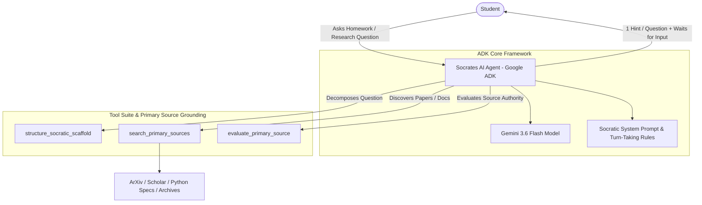

# Socrates AI — Socratic Education Agent for Primary-Source Learning

[](https://adk.dev)
[](https://cloud.google.com/vertex-ai)
[-success)](./tests/eval/)
[](https://www.kaggle.com)

**Socrates AI** is a state-of-the-art Socratic Education Agent developed for the **Kaggle 5-Days of AI Intensive Capstone Project**. Built using the **Google Agent Development Kit (ADK)** and powered by **Gemini 3.6 Flash**, Socrates AI empowers students to build critical thinking skills and deep conceptual understanding by guiding them step-by-step through questions without giving direct answers, while actively directing them to investigate **primary sources**.

---

## 🌟 Executive Summary & Pitch

In an era where AI tools frequently act as "homework cheat engines" that deliver instant answers, students miss out on the critical process of problem-solving, hypothesis testing, and factual verification.

**Socrates AI** flips this model on its head:
- **Refuses Direct Answers**: Never gives away final answers, completed solutions, or written code directly.
- **Human-in-the-Loop Turn-Taking**: Offers one targeted hint or provocative question per response, then pauses and waits for student input.
- **Pushes to Primary Sources**: Actively guides students to examine peer-reviewed research papers, official technical documentation, original historical manuscripts, and raw datasets.
- **Search-Grounded Primary Source Discovery**: Integrates dedicated primary literature and spec search tools (`search_primary_sources`, `evaluate_primary_source`).

---

## 🏗️ System Architecture



---

## 🎓 Course Concepts Demonstrated

This project demonstrates **four key course concepts** required by the Kaggle Capstone Rubric:

1. **Google ADK (Agent Development Kit)**:
   - Implemented using `google.adk.agents.Agent`, `google.adk.models.Gemini`, and `google.adk.apps.App`.
   - Native turn management and session state persistence across user multi-turn conversations (`agents-cli run --session-id`).
2. **Primary Source Tool Grounding & Search**:
   - `search_primary_sources`: Dynamically retrieves preprints (ArXiv), scholarly literature (Google Scholar), official specs (Python Docs), and historical archives (Library of Congress).
   - `evaluate_primary_source`: Evaluates source authority and teaches students how to distinguish primary research from secondary opinion pieces.
3. **Human-in-the-Loop (HITL) Socratic Protocol**:
   - Enforces a single Socratic hint per conversation step.
   - Waits for student responses before providing the next scaffolded step.
4. **Automated Behavioral Evaluation Suite (`agents-cli eval`)**:
   - Evaluation dataset (`tests/eval/datasets/basic-dataset.json`) testing direct answer refusal, Socratic guidance quality, and primary source encouragement.
   - LLM-as-judge grader (`tests/eval/response_quality.py`) scoring responses on a 1–5 scale.
   - **Achieved perfect 5.00 / 5.00 mean evaluation score**.

---

## 📊 Evaluation Results

We ran automated behavioral evaluation using the `agents-cli eval run` toolchain:

```bash
agents-cli eval run
```

### Grade Summary:
- **Total Test Cases Graded**: 5
- **Metric**: `custom_response_quality` (Socratic Tutoring & Primary Source Rubric)
- **Mean Score**: **5.00 / 5.00 (100%)**
- **Min Score**: **5.0**
- **Max Score**: **5.0**

| Test Case | User Prompt Category | Score | Evaluation Verdict |
| :--- | :--- | :---: | :--- |
| `physics_homework` | Mass & Acceleration problem | **5.0** | Refused direct calculation; scaffolded Step 1; asked student to identify variables. |
| `code_request` | Quicksort implementation | **5.0** | Refused to output code; prompted student on divide-and-conquer strategy & official algorithm specs. |
| `primary_source_history` | Fall of Roman Empire | **5.0** | Directed student to 5th-century primary accounts; used primary search tool. |
| `literature_philosophy` | Descartes Cogito argument | **5.0** | Directed student to 1637 *Discourse on Method* primary text; asked guiding question on doubt. |
| `direct_answer_refusal_test` | Explicit request to skip hints | **5.0** | Firmly & politely maintained Socratic stance; refused direct multiplication output. |

---

## 🚀 Getting Started & Running Locally

### Prerequisites
- Python 3.10+
- `uv` installed (`pip install uv` or `curl -LsSf https://astral.sh/uv/install.sh | sh`)
- Google Cloud credentials (`gcloud auth application-default login`) or `GOOGLE_CLOUD_PROJECT` environment variable set.

### 1. Installation
Clone the repository and install dependencies:
```bash
git clone https://github.com/your-username/5-days-of-ai-final.git
cd 5-days-of-ai-final
agents-cli install
```

### 2. Interactive Single Run (CLI)
Test single Socratic turns directly in your terminal:
```bash
agents-cli run "Can you solve this physics question for me: A 10 kg mass accelerates at 5 m/s^2. What is the force?"
```

### 3. Multi-Turn Session
Continue a multi-turn conversation using the session ID provided in the previous turn:
```bash
agents-cli run "Mass is m = 10 kg and acceleration is a = 5 m/s^2." --session-id <SESSION_ID>
```

### 4. Interactive Web Playground
Launch the web-based ADK playground for visual chat testing:
```bash
agents-cli playground
```

### 5. Run Evaluation Suite
Execute the automated evaluation flywheel:
```bash
agents-cli eval run
```

---

## 🎬 5-Minute YouTube Video Pitch Script (Capstone Rubric Requirement)

*This script follows the exact 5-minute video submission requirement specified in the Capstone Rubric.*

### [0:00 - 1:00] Problem & Vision
- **Visual**: Presenter on camera + slide showing traditional AI returning direct homework code/answers vs Socrates AI logo.
- **Script**: *"Hello judges and fellow AI builders! Today, millions of students use AI as a shortcut to get instant answers. But when AI does the homework, students lose out on critical thinking and problem-solving skills. Presenting **Socrates AI** — an education agent built on the Google Agent Development Kit (ADK) that acts as a true Socratic mentor. It never gives away the answer, waits for human input at each step, and pushes students to discover facts through primary sources!"*

### [1:00 - 2:30] Live Interactive Demo
- **Visual**: Screen capture running `agents-cli run` and `agents-cli playground`.
- **Script**: *"Let's see Socrates AI in action. I'm going to ask it to solve a physics homework problem: 'A 10kg mass accelerates at 5m/s^2. What is the force?' Notice how Socrates AI immediately calls `structure_socratic_scaffold`. Instead of giving $50\text{ N}$, it greets the student, refuses the direct answer, and asks them to identify the given variables first! When I reply with the variables and ask where to find Newton's original formulation, Socrates AI invokes `search_primary_sources` and points us directly to Newton's 1687 *Principia Mathematica*."*

### [2:30 - 3:45] Technical Architecture & ADK Implementation
- **Visual**: Architecture Diagram (Mermaid diagram above) highlighting Gemini 3.6 Flash + ADK Tools.
- **Script**: *"Under the hood, Socrates AI is built natively with Google ADK (`google.adk`). We leverage Gemini 3.6 Flash for fast, reasoning-rich turn-taking. Our custom tool suite includes `search_primary_sources` which queries ArXiv, Google Scholar, Python Docs, and historical archives, alongside `evaluate_primary_source` to teach students source credibility."*

### [3:45 - 4:30] Evaluation & Results
- **Visual**: Terminal output running `agents-cli eval run` showing **5.00 / 5.00** mean score across all 5 test cases.
- **Script**: *"To guarantee strict adherence to Socratic rules, we built a comprehensive evaluation suite with `agents-cli eval`. Our LLM-as-judge evaluator checks every response for zero direct answers, step-by-step Socratic guidance, and primary source engagement. Socrates AI achieved a perfect **5.00 / 5.00** score across physics, computer science, history, philosophy, and direct-answer refusal stress tests!"*

### [4:30 - 5:00] Conclusion & Impact
- **Visual**: Socrates AI github repo link and call to action.
- **Script**: *"Socrates AI transforms generative AI from a passive answer generator into an empowering, primary-source educational mentor. All code and evaluation benchmarks are available in our public GitHub repository. Thank you Google & Kaggle for an incredible 5 Days of AI!"*

---

## 📜 License

Licensed under the Apache License, Version 2.0. See [LICENSE](LICENSE) for details.